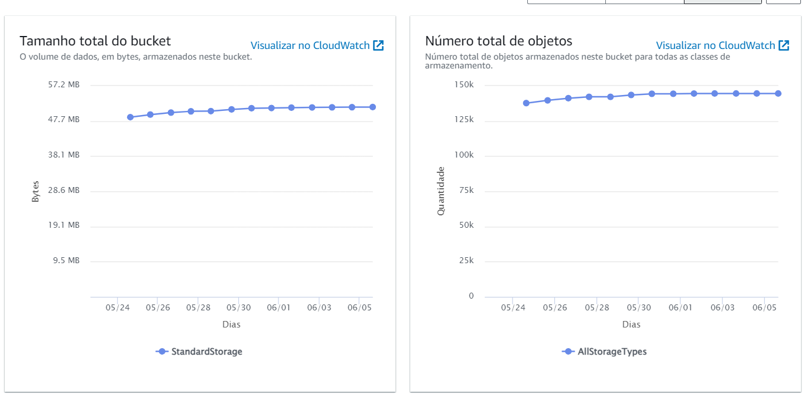

# **Projeto de análise de dados do Bolsa-família**

Este é o resultado parcial do projeto de análise dos dados do Bolsa-Família disponibilizados na [API do Portal da Transparência do Governo Federal](https://api.portaldatransparencia.gov.br/swagger-ui.html) que ainda está em processo. Este projeto iniciou-se no desejo de expandir meus conhecimento sobre as ferramentas da AWS, bem como praticar códigos, o uso de ferramentas e criar um banco de dados com informações populares para praticar a análise e interpretação de dados.

Por ser um projeto de grande proporção, dividi em etapas afim de organizar meu trabalho, otimizar os custos e facilitar o entendimento de terceiros.

## A divisão se dá em 3 etapas:

1. **Ingestão de dados**
2. **ETL**
3. **Análise**

### Etapa 1: Ingestão de dados

Iniciei o projeto estudando a API de dados do Governo Federal e escolhi os dados do programa Bolsa-Família afim de focar nas variáveis:

- Município
- Total gasto no mês

Para isso, foi preciso encontrar a variável *Código IBGE*, disponível na [API de localidades do portal do IBGE](https://servicodados.ibge.gov.br/api/docs/localidades). Para esta tarefa, fiz um código em Python para percorrer os dados de municípios desta API, inicialmente ingerindo os dados separados por região (Norte, Nordeste, Centro-oeste, Sudeste e Sul) e em seguida retirando somente os códigos desejados para finalmente salvá-los em um CSV. Este trecho está disponível na pasta [codigosIbge](https://github.com/jonesamandajones/bolsa-familia/tree/main/codigosIbge).

Utilizando o Lambda Function da AWS, criei outro código em Python que segue em loop os passos abaixo:

* Cria o header de requerimento da API do Governo a partir de lista de ano/mês dentro do espaço de tempo escolhido (2012 a 2022), do código IBGE retirado da lista criada em CSV e com a paginação (por padrão, 1);
* Verifica no S3 da AWS se já foi criado o arquivo com os parâmetros do header criado;
* Acessa o segredo salvo no Secrets Manager com o token de acesso à API;
* Faz o requerimento utilizando biblioteca Requests à API com o token e header gerado;
* Salva o objeto recebido no S3 da AWS clusterizando por código IBGE, ano e mês.

Este código pode ser encontrado na pasta [ingestao_s3](https://github.com/jonesamandajones/bolsa-familia/tree/main/ingestao_s3).

O Lambda Function está programado para ser ativado a cada 20 minutos pelo **EventBridge** da AWS, garantindo a automação desta ingestão de dados até a conclusão da mesma.

### Etapa 2: ETL

Assim que a ingestão de dados no S3 estiver concluída, iniciarei o processo de extração, transformação e carregamento (ETL) dos dados para a análise utilizando **Amazon Athena** e **AWS Glue**, criando um esquema de tabelas organizados por municípios, data e valor gasto.

### Etapa 3: Análise

Com o esquema de tabelas organizado na etapa 2, pretendo utilizar **Pyspark** e **Matplotlib** em **Jupyter notebook** para gerar os gráficos finais dos dados. É possível utilizar um **Docker-compose**, como o encontrado na pasta [docker](https://github.com/jonesamandajones/bolsa-familia/tree/main/docker), para subir uma imagem que permita a utilização do Pyspark.

---

## **Status atual**:

Neste momento, o projeto encontra-se no processo de **ingestão de dados**, é possível conferir o status do S3 em 09/05/2023 na imagem abaixo:

## Entendendo a estrutura:

> Na pasta[ ingestao_s3](https://github.com/jonesamandajones/bolsa-familia/tree/main/ingestao_s3) é possível encontrar o arquivo [lambda_function.py](https://github.com/jonesamandajones/bolsa-familia/blob/main/ingestao_s3/lambda_function.py) com o código que está automatizado na AWS.
>
> Na pasta [codigosIbge](https://github.com/jonesamandajones/bolsa-familia/tree/main/codigosIbge) temos o arquivo [get_ibge_codes.py](https://github.com/jonesamandajones/bolsa-familia/blob/main/codigosIbge/get_ibge_codes.py) que puxa os dados da API do IBGE por região e depois cria o [ibge_codes.csv](https://github.com/jonesamandajones/bolsa-familia/blob/main/codigosIbge/ibge_codes.csv) com uma lista de todos os códigos IBGE existentes no país, necessários na criação do header para requerimento da [API do Portal da Transparência](https://api.portaldatransparencia.gov.br/swagger-ui.html#/) pelo Lambda Function.
>
> Na pasta [docker](https://github.com/jonesamandajones/bolsa-familia/tree/main/docker) está o docker-compose formatado para utilizar pyspark nas futuras análises. Os códigos presentes no notebook estão apenas mockados, enquanto aguardo a finalisação das etapas anteriores.
>
> As imagens utilizadas aqui no Readme estão guardadas na pasta images.
>
> O arquivo [requirements.txt](https://github.com/jonesamandajones/bolsa-familia/blob/main/ingestao_s3/requirements.txt) está na pasta [ingestao_s3](https://github.com/jonesamandajones/bolsa-familia/tree/main/ingestao_s3)
>
> Para a utilização do código localmente, que gera um lambda function e um bucket no S3 como o mostrado até aqui, é possível baixar o aquivo [deploy.sh](https://github.com/jonesamandajones/bolsa-familia/blob/main/deploy.sh) e executá-lo em seu terminal. Para isso é necessário ter uma conta AWS ativa e o AWS CLI instalado em sua máquina.
